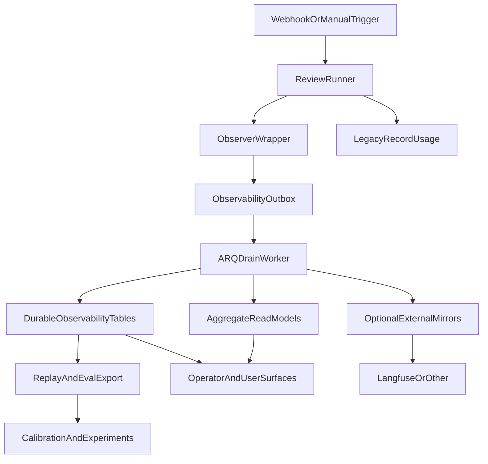
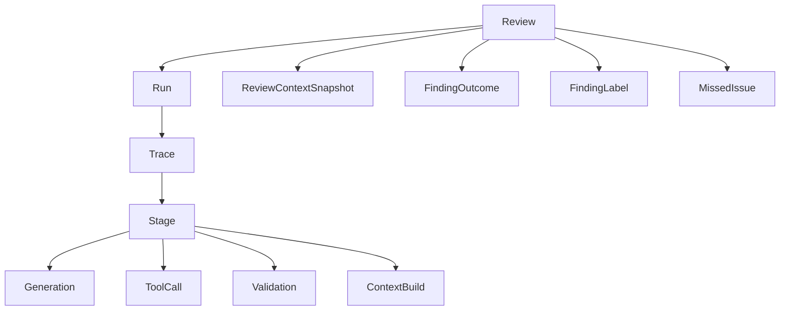

# Durable Observability and Data Traversal

> **Status:** Design outline  
> **Audience:** Backend, eval, product, and operations engineers  
> **Purpose:** Define the durable internal storage and queue-backed workflow Nash AI should use to preserve review data safely, traverse it reliably, and surface it so end users and operators can reach the right action or insight.

---

## 1. Why this exists

Nash AI needs to preserve review telemetry and outcome data before expanding framework integrations.

The immediate priority is not prettier traces. It is:

1. Capture review activity safely.
2. Preserve it durably inside Nash.
3. Traverse it by stable IDs across review, stage, generation, tool call, finding, label, and outcome.
4. Make it possible for operators and end users to eventually get from a question to the right evidence or action surface.

The core principle is:

**Internal durable storage is the source of truth. External systems are mirrors.**

---

## 2. Design goals

### Goals

- Preserve observability and feedback data even if external sinks are down.
- Keep review execution fail-open and low-latency.
- Prevent raw prompt/code leakage by default.
- Support replay, eval export, calibration, and experiments from internal data.
- Provide stable traversal from `review_id` to all subordinate events and outcomes.
- Allow end users and operators to move from a review to evidence, outcomes, and recommended next steps.

### Non-goals

- Replace legacy `record_usage` accounting in the first pass.
- Make Langfuse, DeepEval, or Braintrust authoritative.
- Ship full analytics UI in the first durable-storage pass.
- Store raw prompts/diffs/tool outputs externally by default.

---

## 3. Core architecture

### Source-of-truth order

1. `record_usage` remains authoritative for billing/quota/cost in the first pass.
2. Observability events are dual-written as non-authoritative metadata.
3. Durable internal event/outbox storage becomes authoritative for telemetry traversal.
4. External systems mirror internal facts later.

---

## 4. Data flow workflow

### Step 1: Review starts

- Webhook or manual retry creates/identifies a `review_id`.
- Runner creates a `run_id` for this execution attempt.
- Observer creates a `trace_id`.

### Step 2: Runtime emits metadata-only events

- Runner emits review lifecycle and stage lifecycle events.
- `loop.py`, `fast_path.py`, and `finalize.py` emit generation events at the wrapper level.
- Tool execution emits tool-call events.
- Validation emits validation events.
- Context build emits context-build events.

Each event is:

- redacted or hashed by policy,
- assigned stable IDs,
- written to an internal **outbox** record,
- not synchronously shipped to external systems.

### Step 3: Outbox queue traversal

- ARQ worker drains outbox rows in batches.
- Worker writes normalized events into durable internal tables.
- Worker derives aggregate read models and queue-safe mirrors.
- If external sinks fail, outbox rows stay retryable.

### Step 4: Durable internal storage

Durable tables hold:

- review trace and stage lifecycle,
- generation/tool/validation/context events,
- derived aggregate metrics,
- links to `ReviewContextSnapshot`,
- links to `FindingLabel`, `FindingOutcome`, and `MissedIssue`.

### Step 5: Replay and analytics

Once stored internally, data can drive:

- snapshot replay evals,
- production-to-eval export,
- calibration,
- threshold tuning,
- prompt/model experiments,
- dashboard and operator tooling.

---

## 5. Queueing and durability model

### Why queueing is required

Direct fire-and-forget sink writes are acceptable for smoke instrumentation but not for preservation.

If Nash cares about keeping data:

- API or worker process crashes cannot drop the event silently.
- Langfuse latency cannot sit in the review hot path.
- DB durability must not depend on external services.
- retries must be explicit and observable.

### Recommended pattern

Use a **DB outbox + ARQ drain worker**.

#### Write path

- Review code writes an outbox row in the local transaction boundary available at that step.
- The write is metadata-only and small.
- If outbox insert fails, the review still proceeds, but this is logged as an internal durability defect.

#### Drain path

- ARQ worker polls outbox rows.
- Worker marks a row `processing`.
- Worker writes normalized event tables and read models.
- Worker mirrors externally if configured.
- Worker marks row `done` or `retryable_failed`.

### Why DB outbox before Redis-only queue

Redis is useful for processing, but Postgres should hold the durable canonical enqueue record.

Use:

- **Postgres outbox** for durability,
- **ARQ/Redis** for traversal and async drain.

That gives durable enqueue plus scalable async processing.

---

## 6. Event ownership

To prevent duplicate generation events, ownership must be explicit.

| Event | Owner |
|---|---|
| `review_trace_started` / `review_trace_finished` | `app/agent/runner.py` |
| `stage_started` / `stage_finished` | `app/agent/runner.py` |
| `generation` | wrapper at call site: `loop.py`, `fast_path.py`, `finalize.py` |
| `tool_call` | tool execution layer in `loop.py` |
| `validation` | validation/finalization layer |
| `context_build` | `context_builder.py` or runner boundary |
| provider usage normalization | provider adapters only return normalized usage |

### Rule

**Emit each LLM generation exactly once, at the highest common wrapper around the provider call.**

Adapters must not emit independently unless a path truly bypasses all wrappers.

---

## 7. Identity and traversal contract

Every event must be traversable by stable IDs.

### Required identity fields

- `review_id`
- `run_id`
- `trace_id`
- `stage_id`
- `span_id`
- `parent_span_id`
- `event_id`
- `event_type`
- `timestamp`
- `stage`
- `provider`
- `model`
- `prompt_version`

### Generation-specific fields

- `generation_id`
- `attempt_index`
- `fallback_reason`
- `request_hash`
- `response_hash`
- `input_tokens`
- `output_tokens`
- `cached_input_tokens`
- `cache_creation_input_tokens`
- `latency_ms`
- `error_class`

### Tool-call-specific fields

- `tool_call_id`
- `tool_name`
- `duration_ms`
- `success`
- `error_class`
- `input_hash`
- `output_hash`

### Traversal direction

This structure allows a user or operator to ask:

- Why was this finding posted?
- Which generation produced it?
- What evidence supported it?
- What did it cost?
- Was it later dismissed, useful, or ignored?
- Did a similar miss become a regression case?

---

## 8. Guardrails

### Safety defaults

- `observability_enabled=false` by default
- `observability_payload_mode=metadata_only` by default
- legacy `record_usage` remains authoritative
- external mirrors disabled by default

### Data protection

- No raw prompts, diffs, code, or tool outputs leave the process by default.
- Metadata-only means hashes, lengths, token counts, file counts, and counters.
- Raw payload mode is local-debug only.
- No secret values logged, only safe metadata.

### Reliability

- Review execution is fail-open.
- Outbox drain is retryable and observable.
- External mirrors cannot block review completion.
- Max events per review prevents runaway loops from flooding storage.

### Consistency

- Exactly-once generation emission at wrapper level.
- Idempotent outbox drain by `event_id`.
- Terminal status required for every trace and stage.

### Security and tenancy

- All durable tables remain tenant-scoped.
- Any API read surface must respect installation/user boundaries.
- Redaction happens before external mirroring.

---

## 9. Storage layers

### Layer A: legacy authoritative accounting

Current source of truth:

- `record_usage`
- `ReviewModelAudit`
- review cost/budget fields

Do not replace this in the first pass.

### Layer B: durable event storage

Recommended new storage:

- `observability_outbox`
- `review_trace_events`
- `review_stage_events`
- `llm_generation_events`
- `tool_call_events`
- `validation_events`
- `context_build_events`

### Layer C: aggregate read models

Derived tables or materialized views for:

- cost by provider/model/stage
- latency p50/p95
- validator drop rate
- anchor/schema validity
- useful/dismiss/ignore rates
- findings per 1k changed lines
- false-positive and false-negative rates by bucket/category

### Layer D: mirrors

Optional sinks:

- Langfuse
- Braintrust
- future OTEL/Sentry enrichment

Mirrors read from Layer B or C, not from the hot path.

---

## 10. End-user and operator traversal

The system should let different people get where they need to go.

### Author / reviewer

Goal: understand what Nash posted and whether it is actionable.

Path:

1. PR review page
2. finding
3. evidence + anchor + suggestion
4. outcome state (`pending`, `acknowledged`, `dismissed`, `ignored`)

### Operator

Goal: understand whether the system is healthy and trustworthy.

Path:

1. review trace
2. stage timings
3. generation attempts and fallback path
4. validator drops / anchor failures
5. cost, latency, and payload pressure
6. linked findings and outcomes

### Eval / prompt engineer

Goal: understand whether the system is improving.

Path:

1. production review
2. linked snapshot
3. labeled findings / missed issues
4. exported eval case
5. benchmark result
6. calibration dashboard
7. experiment decision

### Product / support

Goal: answer “why did Nash do this?” or “why didn’t Nash catch this?”

Path:

1. `review_id`
2. trace + lifecycle
3. generation + tool evidence
4. validation and policy filter result
5. final finding outcome or missed issue

---

## 11. Rollout sequence

### Phase A: safe internal capture

- metadata-only observer events
- in-memory test sink
- structured log sink
- worker + API bootstrap
- lifecycle closure tests

### Phase B: durable internal storage

- outbox table
- ARQ drain worker
- normalized event tables
- idempotency and retry logic

### Phase C: product traversal

- review trace lookup
- operator-facing review diagnostics
- links from review to outcomes and snapshots

### Phase D: replay and calibration

- eval export from internal storage
- scorecards
- calibration and threshold dashboards

### Phase E: external mirrors

- Langfuse datasets/experiments
- optional Braintrust mirror

---

## 12. Minimum tests

- observer disabled emits nothing
- observer enabled does not change review result
- sink failure does not fail review
- one LLM call produces exactly one generation event
- structured-output path emits generation event
- worker bootstrap initializes observer
- early return closes trace with terminal status
- exception closes trace with `failed` status
- redaction default blocks raw prompt/code
- legacy usage parity remains intact
- outbox drain is idempotent by `event_id`
- external mirror failure does not block internal persistence

---

## 13. Immediate recommendation

If the goal is to **start gathering data now without losing it**, the next concrete implementation order should be:

1. Metadata-only observer events
2. Postgres outbox table
3. ARQ drain worker
4. Durable internal event tables
5. Review-to-trace traversal UI/API
6. Replay/export pipeline
7. Langfuse mirror

That sequence preserves data first, keeps review execution safe, and builds a path from runtime telemetry to user-visible insight.

---

## 14. Langfuse traceability mirror

Langfuse should receive the same internal IDs used by durable Nash storage:

- `trace_id` as the Langfuse trace ID when supported by the SDK
- `span_id` as the Langfuse span ID when supported
- `generation_id` as the Langfuse generation ID when supported
- `review_id`, `run_id`, `stage_id`, and `prompt_version` in metadata

Recommended rollout:

1. `OBSERVABILITY_SINKS=log`
2. `OBSERVABILITY_SINKS=log,db`
3. `OBSERVABILITY_SINKS=log,db,langfuse`

Langfuse failures must not affect review completion or durable internal audit writes. Operators should use `/api/v1/usage/traceability` to verify internal trace coverage before trusting external trace mirrors.
